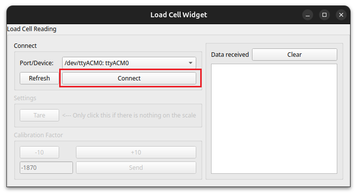
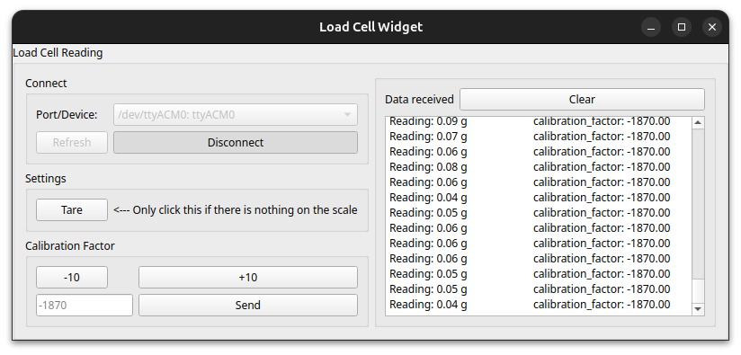

# Load cell reading

---

# Quick Start

## Setup
- Open command prompt/terminal
- Navigate into the directory "Mar_lab-Food_delivery"
- Activate virtual environment
- Run the python application ```HX711_Calibration.py```

## Usage

### Basic usage
- Open the GUI and connect to the Arduino

- Current reading and calibration factor will be displayed in the "Data received" box


### To tare:
- Remove all weight from the scale
- Click **"Tare"**
- The current reading will reset to 0.00 g

### To calibrate
- Tare the scale
- Place a known weight on the scale
- Adjust the calibration factor until the reading matches the known weight

<br>

---

# Setup

### Materials
- Arduino UNO
- Load cell (taken from [WeighGram Top-600](https://www.amazon.com/dp/B000O37TDO?ref=clp_hp_h_pc&th=1) scale)
- [HX711 Amplifier](https://www.sparkfun.com/sparkfun-load-cell-amplifier-hx711.html#content-features)
- Dupont wires


### Hardware Setup

- Break load cell out of scale. Connect female crimp pins to red, black, green, and white wires
- Connect load cell to Sparkfun HX711 amplifier board
    - Swap white and green wire positions
- Connect DX711 to Arduino UNO
    - Jumper VCC/VDD
    - VCC ---> 3.3V # TODO check if this should be 5V instead...
    - DAT ---> 3
    - CLK ---> 2
    - GND ---> GND

### Install HX711 Arduino package

- Download .zip file from [HX711 Github](https://github.com/bogde/HX711).
- In Arduino, go to Sketch --> Include Library --> Add .ZIP Library
- Select HX711-master.zip

### Upload sketch

- Remove all weight from scale
- Upload sketch
    - Scale will tare and reset to zero
- Open serial monitor at 9600 baud

<br>

---

## Software Installation:

1. Open a command prompt/terminal

2. Navigate to the directory you want to store these files
   
   ```bash
   cd <folder_you_want>
   ```
   **Note:** folder name may need to be in quotes

3. Clone this repository & navigate into that folder
   ```bash
   git clone https://github.com/tooles01/Mar_lab-Food_delivery.git
   cd Mar_lab-Food_delivery
   ```

    **Note:** If git is not installed:
    - Click the green "<>Code" button above
    - Click "Download ZIP"
    - Extract the files. Copy the extracted folder into the desired directory
    - Rename the folder "Mar_lab-Food_delivery"
    - Go back to the open terminal and type in:
        ```bash
        cd Mar_lab-Food_delivery
        ```

4. Create & activate a virtual environment

    Windows:
    ```bash
    python -m venv <environment_name>
    <environment_name\scripts\activate.bat
    ```
    Linux:
    ```bash
    python3 -m venv <environment_name>
    source environment_name/bin/activate
    ```

5. Install dependencies
   ```bash
   pip install PyQt5 pyserial
   ```

6. Run the application

    Windows:
   ```bash
   python Load_cell/HX711_Calibration.py
   ```
    Linux:
   ```bash
   python3 Load_cell/HX711_Calibration.py
   ```

